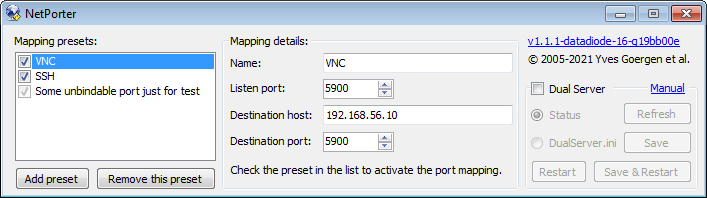
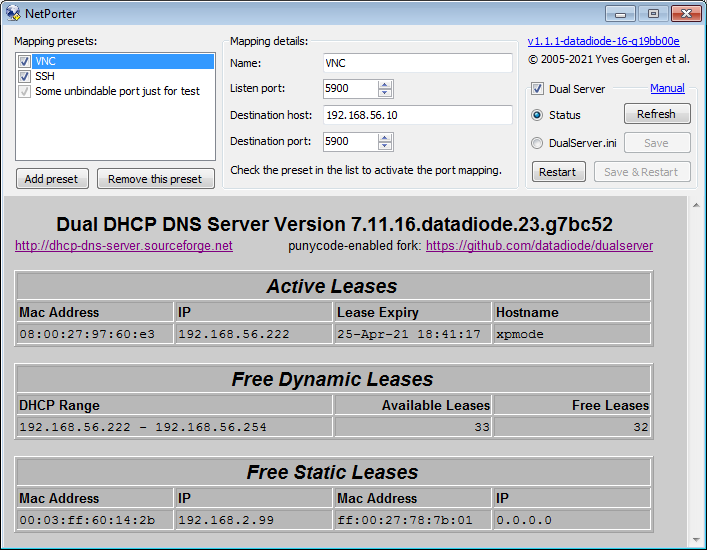
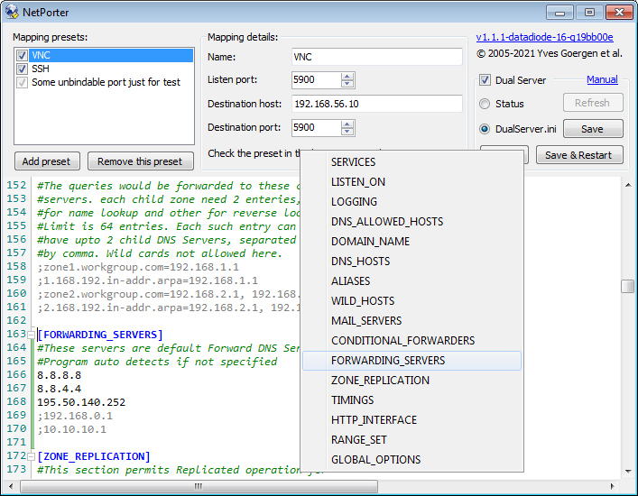

# NetPorter

This fork of [NetPorter](https://unclassified.software/en/apps/netporter "") provides an integrated GUI to configure its native port forwarding feature, as well as configure and monitor DHCP and DNS through [Dual&nbsp;Server](https://github.com/datadiode/dualserver "").

  
*Dual Server disabled*

  
*Dual Server status page*

  
*Dual Server INI file editor with context menu to help navigate the sections*
